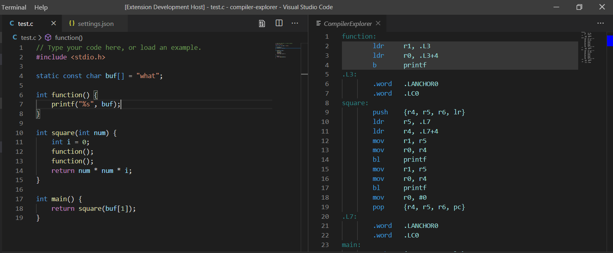

# VSCode Compiler Explorer

VSCode compiler explorer is an extension that allows you to view Compiler Explorer output in VSCode.

Compiler Explorer: https://godbolt.org/
Compiler Explorer Github: https://github.com/mattgodbolt/compiler-explorer



## Usage 

The default settings are enough to get started. Simply create a `test.c` file like below

```c
int square(int num) {
    return num * num;
}

int main() {
    int i = 0;
    return square(i);
}
```

Then open the compiler explorer extension; `Ctrl + shift + p`, then search `compiler-explorer` to open the compiler explorer.

The default settings are to use GCC 9.2.0 from `https://godbolt.org` with high optimizations `-O3`. The output you will see is x86.

### Advanced Usage

This extension does not compile your code itself. It uses the Compiler Explorer API to do so (https://github.com/mattgodbolt/compiler-explorer/blob/master/docs/API.md).

You need to specify what compiler and compiler options you want to include in the API call.

```
{
    "compiler-explorer.url": "https://godbolt.org", // url of the compiler explorer you want to use.
    "compiler-explorer.compiler": "carmg820", // Compiler code - See help below.
    "compiler-explorer.options": "-O3", // Compiler options
    "compiler-explorer.debug": true, // true indicates that the extension will print debug to its output channel.
    "compiler-explorer.include": [<filepaths>]
}
```

Once your settings are specified, you can open the compiler explorer with the command.

`Ctrl + shift + p`, then search `compiler-explorer` to open the compiler explorer. It will automatically update when you save the file you are editing.

`compiler-explorer.include` may contain absolute filepaths or filepaths starting with `${workspaceFolder}`.

## Compiler Selection

The Compiler Explorer assigns a unique code to each compiler it offers. This is the compiler code that you need to put in the config settings. You can find a list of the compilers offered by Compiler Explorer, with a list of human readable names at (simple `GET` request) `<compiler-explorer.url>/api/compilers`. E.g. `https://godbolt.org/api/compilers` provides a list that starts like,

```
Compiler Name             | Name
cc65_217                  | 6502 cc65 2.17
cc65_trunk                | 6502 cc65 trunk
farm64g640                | AARCH64 gfortran 6.4
farm64g730                | AARCH64 gfortran 7.3
farm64g820                | AARCH64 gfortran 8.2
armg454                   | ARM gcc 4.5.4 (linux)
carmg454                  | ARM gcc 4.5.4 (linux)
armg464                   | ARM gcc 4.6.4 (linux)
carmg464                  | ARM gcc 4.6.4 (linux)
armhfg54                  | ARM gcc 5.4 (linux)
carmhfg54                 | ARM gcc 5.4 (linux)
arm541                    | ARM gcc 5.4.1 (none)
carm541                   | ARM gcc 5.4.1 (none)
armg630                   | ARM gcc 6.3.0 (linux)
carmg630                  | ARM gcc 6.3.0 (linux)
armg640                   | ARM gcc 6.4
carmg640                  | ARM gcc 6.4
arm710                    | ARM gcc 7.2.1 (none)
```

## Current Restrictions

I haven't done any validation for anything other than C/C++; currently the extension checks you are using those two languages.

In order to use the `compiler-explorer.include` option, you must host the compiler explorer yourself (e.g. Locally) and enable the `-I` command line argument. Please see the compiler explorer github for instructions.

E.g. On your local instance of compiler explorer, open the config `compiler-explorer.defaults.properties`, and change the `optionsBlacklistRe=` regular expression to NOT match `-I`.

## Current Bugs

Syntax Highlighting has issues.

## Todo

I'd like to use an already existing syntax/tokenizer for the assembly. I want to use the syntax highlighter from compiler explorer.